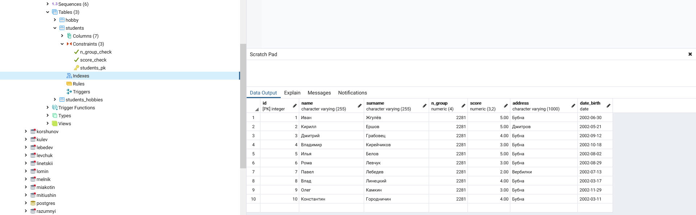
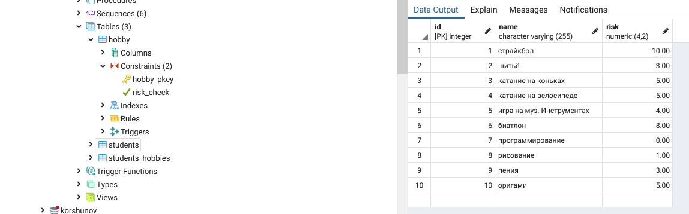
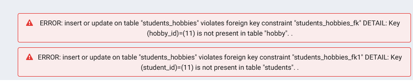
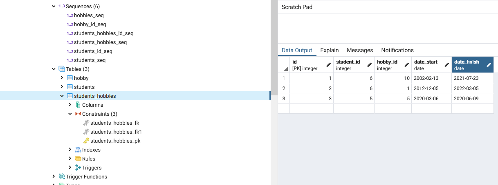

# Задание 1

Я создал 3 таблицы 

+ [students](#students)
+ [hobby](#hobby)
+ [students_hobbies](#students_hobbies)

также, я приложил к заданию csv таблиц. Не знаю, зачем

-----------------------------------------------------------
## <a name="students"></a> 1. students:
была создана таблица `students` с семью колонками

### Пример

id | name | surname | n_group | score | address | date_birth
---|------|---------|---------|-------|---------|------------
1  | Иван | Жгулёв  | 2281    | 5.00  | Бубна   | 2002-06-30

В базе 10 человек и id от 1 до 10. 

### Код запросов

```SQL
CREATE table STUDENTS (
    id         sterial
    NAME       VARCHAR(255) NOT NULL,
    SURNAME    VARCHAR(255),
    N_GROUP    NUMERIC(4,0) NOT NULL,
    SCORE      NUMERIC(3,2) NOT NULL,
    ADDRESS    VARCHAR(1000),
    date_birth DATE,
    constraint  STUDENTS_PK primary key (id)
);

CREATE sequence STUDENTS_SEQ;

alter table STUDENTS add
constraint SCORE_CHECK
check (SCORE >= 2 and SCORE <=5);

alter table STUDENTS add
constraint n_group_check
check (n_group >= 1000 and n_group <= 9999);
```

Так выглядит таблица:



-------------------------------------------------------------
## <a name="hobby"></a> 2. hobby:

Создал таблицу `hobby` с тремя колонками

### Пример

id |    name   | risk
---|-----------|---------
1  | страйкбол | 10,00

В базе 10 занятий и id от 1 до 10. 

### Код запросов

```SQL
CREATE table HOBBY (
    id         serial,
    NAME       VARCHAR(255) NOT NULL,
    RISK    NUMERIC(4,2) NOT NULL,
    constraint  HOBBIES_PK primary key (id)
);

CREATE sequence HOBBIES_SEQ;

alter table HOBBY add
constraint RISK_CHECK
check (RISK >= 0 and RISK <= 10);
```

Так выглядит таблица:



----------------------------------------------------------

## <a name="students_hobbies"></a> 3. students hobbies:

Последняя таблица `students_hobbies` с пятью колонками

### пример

id | student_id | hobby_id | date_start | date_finish
---|------------|----------|------------|-------------
1  |   4        |    2     | 2002-03-16 | 2020-05-8

База может быть заполнена значениями student_id и hobby_id только если те притутствуют в базах students и hobby соответственно иначе возникает ошибка элемент не добавляется в базу.



### Код запросов

```SQL
CREATE table STUDENTS_HOBBIES (
    id          serial NOT NULL,
    student_id         NUMERIC(5,0) NOT NULL,
    hobby_id    NUMERIC(5,0) NOT NULL,
    date_start  DATE NOT NULL,
    DATE_FINISH DATE,
    constraint  STUDENTS_HOBBIES_PK primary key (id)
);


CREATE sequence STUDENTS_HOBBIES_SEQ;

ALTER TABLE STUDENTS_HOBBIES ADD CONSTRAINT STUDENTS_HOBBIES_FK
FOREIGN KEY (student_id)
REFERENCES STUDENTS (id);

ALTER TABLE STUDENTS_HOBBIES ADD CONSTRAINT STUDENTS_HOBBIES_FK1
FOREIGN KEY (hobby_id)
REFERENCES HOBBIES (id);
```
Так выглядит таблица:



## Вывод

Фронт работы выполнен, все ограничения работают.