# Задание 2
 
 1. [Однотабличные запросы](#1!!)
 2. [Групповые функции](#2!!)
 3. [Многотабличные запросы](#3!!)

<br></br>

## <a name="1!!"></a>Однотабличные запросы

1. [Вывести всеми возможными способами имена и фамилии студентов, средний балл которых от 4 до 4.5](#1_0)
2. [Познакомиться с функцией CAST. Вывести при помощи неё студентов заданного курса (использовать Like)](#2_0)
3. [Вывести всех студентов, отсортировать по убыванию номера группы и имени от а до я](#3_0)
4. [Вывести студентов, средний балл которых больше 4 и отсортировать по баллу от большего к меньшему](#4_0)
5. [Вывести на экран название и риск футбола и хоккея](#5_0)
6. [Вывести id хобби и id студента которые начали заниматься хобби между двумя заданными датами (выбрать самим) и студенты должны до сих пор заниматься хобби](#6_0)
7. [Вывести студентов, средний балл которых больше 4.5 и отсортировать по баллу от большего к меньшему](#7_0)
8. [Из запроса №7 вывести несколькими способами на экран только 5 студентов с максимальным баллом](#8_0)
9. [Выведите хобби и с использованием условного оператора сделайте риск словами:](#9_0)
10. [Вывести 3 хобби с максимальным риском](#10_0)

###  <a name="1_0"></a> Вывести всеми возможными способами имена и фамилии студентов, средний балл которых от 4 до 4.5

#### `Запрос`

```SQL
select st.name, st.surname, st.n_group, st.score
from students st
where st.score <=4.5 and st.score >= 4
```

#### `Вывод`:

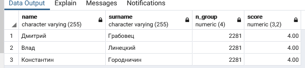

<br></br>

### <a name="2_0"></a> Познакомиться с функцией CAST. Вывести при помощи неё студентов заданного курса (использовать Like)

#### `Запрос`

```SQL
select st.name, st.surname, st.n_group, st.score
from students st
where cast(st.n_group as varchar) like '2281'

-- или

select st.name, st.surname, st.n_group, st.score
from students st
where st.n_group::varchar like '2281'
```

#### `Вывод`

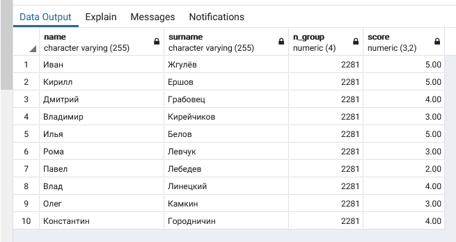

<br></br>

### <a name="3_0"></a> Вывести всех студентов, отсортировать по убыванию номера группы и имени от а до я

#### `Запрос`

```SQL
select st.name, st.surname, st.n_group, st.score
from students st
order by st.n_group desc, st.name 
```

#### `Вывод`

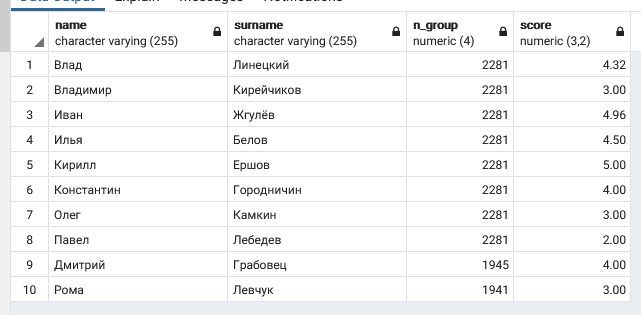

<br></br>

### <a name="4_0"></a> Вывести студентов, средний балл которых больше 4 и отсортировать по баллу от большего к меньшему

#### `Запрос`

```SQL
select st.name, st.surname, st.n_group, st.score
from students st
where score > 4
order by st.score desc
```

#### `Вывод`

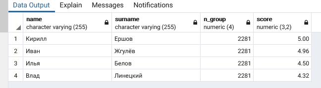

<br></br>

### <a name="5_0"></a> Вывести на экран название и риск футбола и хоккея

#### `Запрос`

```SQL
select hb.name, hb.risk
from hobby hb
where name = 'футбол' or name = 'хоккей'
```

#### `Вывод`

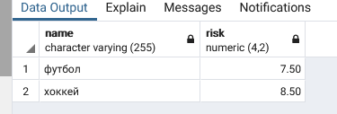

<br></br>

### <a name="6_0"></a> Вывести id хобби и id студента которые начали заниматься хобби между двумя заданными датами (выбрать самим) и студенты должны до сих пор заниматься хобби

#### `Запрос`

```SQL
select st.student_id, st.hobby_id, st.date_start, st.date_finish
from students_hobbies st
where  date_start >= '2002-04-10' and date_finish is null;
```

#### `Вывод`

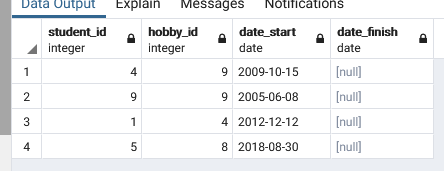

<br></br>

### <a name="7_0"></a> Вывести студентов, средний балл которых больше 4.5 и отсортировать по баллу от большего к меньшему

#### `Запрос`

```SQL
select st.name, st.surname, st.n_group, st.score
from students st
where score > 4.5
order by st.score 
```

#### `Вывод`

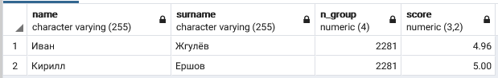

<br></br>

### <a name="8_0"></a> Из запроса №7 вывести несколькими способами на экран только 5 студентов с максимальным баллом

#### `Запрос`

```SQL
select st.name, st.surname, st.n_group, st.score
from students st
where score > 4.5
order by st.score 
/
select st.name, st.surname, st.n_group, st.score
from students st
where score > 4.5 and surname like '%ич'
order by st.score 
/
select st.name, st.surname, st.n_group, st.score
from students st
where score > 4.5 and n_group = 2281
order by st.score 
/
select st.name, st.surname, st.n_group, st.score
from students st
where score > 4.5 and not n_group = 9003
order by st.score 
```

#### `Вывод`

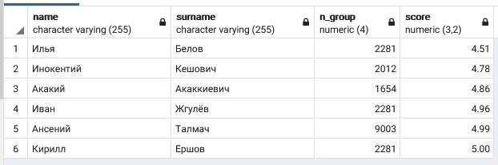

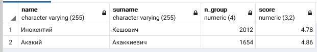

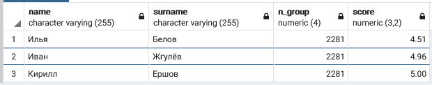

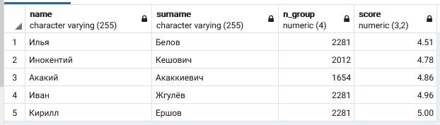

<br></br>

### <a name="9_0"></a> Выведите хобби и с использованием условного оператора сделайте риск словами:

#### `Запрос`

```SQL
select hb.name, hb.risk,
case 
    when risk >=8 then 'очень высокий'
    when risk >= 6 and risk < 8 then 'высокий'
    when risk >= 4 and risk <8 then 'средний'
    when risk >= 2 and risk <4 then 'низкий'
    when risk < 2 then 'очень низкий'
end
from hobby hb
```

#### `Вывод`

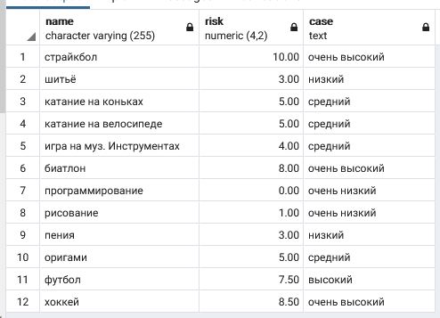

<br></br>

### <a name="10_0"></a> Вывести 3 хобби с максимальным риском

#### `Запрос`

```SQL
select hb.name, hb.risk,
case 
    when risk >=8 then 'очень высокий'
    when risk >= 6 and risk < 8 then 'высокий'
    when risk >= 4 and risk <8 then 'средний'
    when risk >= 2 and risk <4 then 'низкий'
    when risk < 2 then 'очень низкий'
end
from hobby hb
```

#### `Вывод`

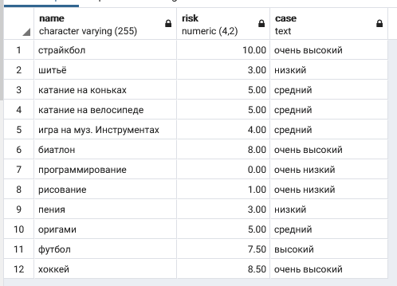

<br></br>

## <a name="2!!"></a>Групповые функции

1. [Выведите на экран номера групп и количество студентов, обучающихся в них](#1_1)
2. [Выведите на экран для каждой группы максимальный средний балл](#1_2)
3. [Подсчитать количество студентов с каждой фамилией](#1_3)
4. [Подсчитать студентов, которые родились в каждом году](#1_4)
5. [Для студентов каждого курса подсчитать средний балл см. Substr](#1_5)
6. [Для студентов заданного курса вывести один номер группы с максимальным средним баллом](#1_6)
7. [Для каждой группы подсчитать средний балл, вывести на экран только те номера групп и их средний балл, в которых он менее или равен 3.5. Отсортировать по от меньшего среднего балла к большему.](#1_7)
8. [Для каждой группы в одном запросе вывести количество студентов, максимальный балл в группе, средний балл в группе, минимальный балл в группе](#1_8)
9. [Вывести студента/ов, который/ые имеют наибольший балл в заданной группе](#1_9)
10. [Аналогично 9 заданию, но вывести в одном запросе для каждой группы студента с максимальным баллом.](#1_10)

<br></br>

### <a name="1_1"></a> Выведите на экран номера групп и количество студентов, обучающихся в них

#### `Запрос`

```SQL
SELECT n_group,
       COUNT(n_group) AS stud_count
FROM students
GROUP BY n_group
ORDER BY n_group DESC;
```

#### `Вывод`

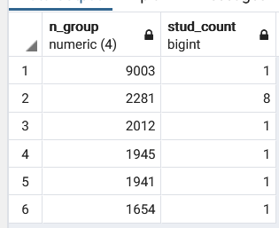

<br></br>

### <a name="1_2"></a> Выведите на экран для каждой группы максимальный средний балл

#### `Запрос`

```SQL
SELECT n_group,
       max(score) AS score_max
FROM students
GROUP BY n_group
ORDER BY n_group DESC;
```

#### `Вывод`

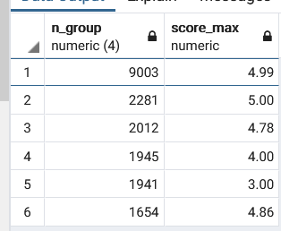

<br></br>

### <a name="1_3"></a> Подсчитать количество студентов с каждой фамилией

#### `Запрос`

```SQL
SELECT surname,
       COUNT(surname) AS surname_unik
FROM students
GROUP BY surname
ORDER BY surname DESC;
```

#### `Вывод`

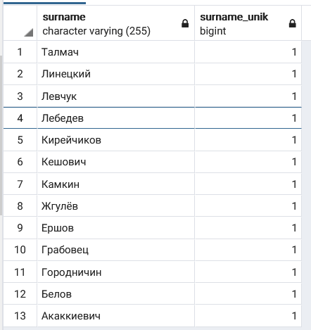

<br></br>

### <a name="1_4"></a> Подсчитать студентов, которые родились в каждом году

#### `Запрос`

```SQL
SELECT COUNT(extract(year from date_birth)) AS count_year, 
	extract(year from date_birth) as tg 
FROM students
GROUP BY tg
ORDER BY tg DESC;
```

#### `Вывод`

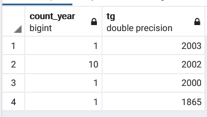

<br></br>

### <a name="1_5"></a> Для студентов каждого курса подсчитать средний балл

#### `Запрос`

```SQL
SELECT left(n_group::varchar, 1) kurs,
	avg(score) as sr_score
FROM students
GROUP BY kurs
ORDER BY kurs DESC;
```

#### `Вывод`

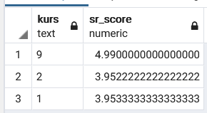

<br></br>

### <a name="1_6"></a> Для студентов заданного курса вывести один номер группы с максимальным средним баллом


#### `Запрос`

```SQL
SELECT max(score) as max_score, n_group
FROM students
where left(n_group::varchar, 1) = '2'
GROUP BY n_group
order by avg(score) desc
limit 1
```

#### `Вывод`

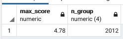

<br></br>

### <a name="1_7"></a> Для каждой группы подсчитать средний балл, вывести на экран только те номера групп и их средний балл, в которых он менее или равен 3.5. Отсортировать по от меньшего среднего балла к большему.


#### `Запрос`

```SQL
SELECT avg(score) as max_score, n_group
FROM students
GROUP BY n_group
having avg(score) <= 3.5
order by avg(score) asc
```

#### `Вывод`

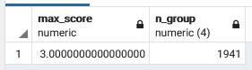

<br></br>

### <a name="1_8"></a> Для каждой группы в одном запросе вывести количество студентов, максимальный балл в группе, средний балл в группе, минимальный балл в группе


#### `Запрос`

```SQL
SELECT n_group, COUNT(n_group) as num_stud, 
    max(score) as max_score, 
    avg(score) as avg_score, 
    min(score) as min_score
FROM students
GROUP BY n_group
```

#### `Вывод`

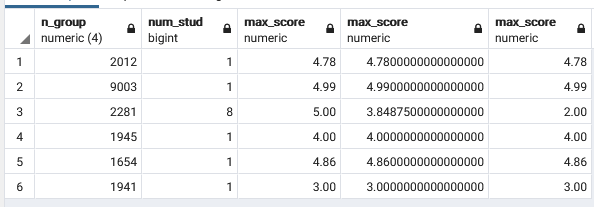

<br></br>

### <a name="1_9"></a> Вывести студента/ов, который/ые имеют наибольший балл в заданной группе

#### `Запрос`

```SQL
select st.*
from(SELECT n_group, max(score) as max_score
	 FROM students
	 GROUP BY n_group
	 having n_group = 2281
) t_my, students st
where st.score = t_my.max_score
```

#### `Вывод`

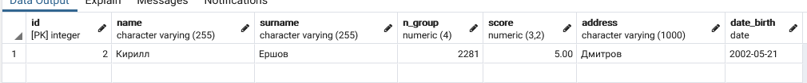

<br></br>

### <a name="1_10"></a> Аналогично 9 заданию, но вывести в одном запросе для каждой группы студента с максимальным баллом.

#### `Запрос`

```SQL
select st.*
from(SELECT n_group, max(score) as max_score
	 FROM students
	 GROUP BY n_group
) t_my, students st
where st.n_group = t_my.n_group and st.score = t_my.max_score
```

#### `Вывод`

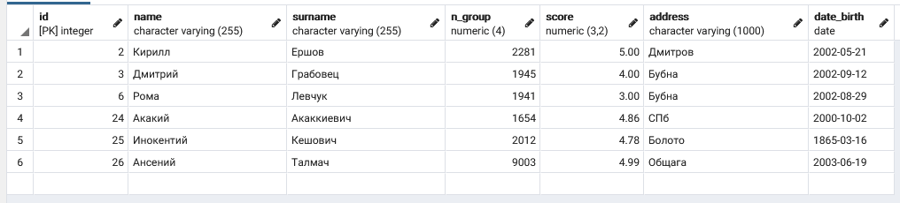

<br></br>

## <a name="3!!"></a>Многотабличные запросы

1. Вывести все имена и фамилии студентов, и название хобби, которым занимается этот студент.
2. Вывести информацию о студенте, занимающимся хобби самое продолжительное время.
3. Вывести имя, фамилию, номер зачетки и дату рождения для студентов, средний балл которых выше среднего, а сумма риска всех хобби, которыми он занимается в данный момент, больше 0.9.
4. Вывести фамилию, имя, зачетку, дату рождения, название хобби и длительность в месяцах, для всех завершенных хобби Диапазон дат.
5. Вывести фамилию, имя, зачетку, дату рождения студентов, которым исполнилось N полных лет на текущую дату, и которые имеют более 1 действующего хобби.
6. Найти средний балл в каждой группе, учитывая только баллы студентов, которые имеют хотя бы одно действующее хобби.
7. Найти название, риск, длительность в месяцах самого продолжительного хобби из действующих, указав номер зачетки студента.
8. Найти все хобби, которыми увлекаются студенты, имеющие максимальный балл.
9. Найти все действующие хобби, которыми увлекаются троечники 2-го курса.
10. Найти номера курсов, на которых более 50% студентов имеют более одного действующего хобби.
11. Вывести номера групп, в которых не менее 60% студентов имеют балл не ниже 4.
12. Для каждого курса подсчитать количество различных действующих хобби на курсе.
13. Вывести номер зачётки, фамилию и имя, дату рождения и номер курса для всех отличников, не имеющих хобби. Отсортировать данные по возрастанию в пределах курса по убыванию даты рождения.
14. Создать представление, в котором отображается вся информация о студентах, которые продолжают заниматься хобби в данный момент и занимаются им как минимум 5 лет.
15. Для каждого хобби вывести количество людей, которые им занимаются.
16. Вывести ИД самого популярного хобби.
17. Вывести всю информацию о студентах, занимающихся самым популярным хобби.
18. Вывести ИД 3х хобби с максимальным риском.
19. Вывести 10 студентов, которые занимаются одним (или несколькими) хобби самое продолжительно время.
20. Вывести номера групп (без повторений), в которых учатся студенты из предыдущего запроса.
21. Создать представление, которое выводит номер зачетки, имя и фамилию студентов, отсортированных по убыванию среднего балла.
22. Представление: найти каждое популярное хобби на каждом курсе.
23. Представление: найти хобби с максимальным риском среди самых популярных хобби на 2 курсе.
24. Представление: для каждого курса подсчитать количество студентов на курсе и количество отличников.
25. Представление: самое популярное хобби среди всех студентов.
26. Создать обновляемое представление.
27. Для каждой буквы алфавита из имени найти максимальный, средний и минимальный балл. (Т.е. среди всех студентов, чьё имя начинается на А (Алексей, Алина, Артур, Анджела) найти то, что указано в задании. Вывести на экран тех, максимальный балл которых больше 3.6
28. Для каждой фамилии на курсе вывести максимальный и минимальный средний балл. (Например, в университете учатся 4 Иванова (1-2-3-4). 1-2-3 учатся на 2 курсе и имеют средний балл 4.1, 4, 3.8 соответственно, а 4 Иванов учится на 3 курсе и имеет балл 4.5. На экране должно быть следующее:
    2 Иванов 4.1 3.8
    3 Иванов 4.5 4.5
29. Для каждого года рождения подсчитать количество хобби, которыми занимаются или занимались студенты.
30. Для каждой буквы алфавита в имени найти максимальный и минимальный риск хобби.
31. Для каждого месяца из даты рождения вывести средний балл студентов, которые занимаются хобби с названием «Футбол»
32. Вывести информацию о студентах, которые занимались или занимаются хотя бы 1 хобби в следующем формате: Имя: Иван, фамилия: Иванов, группа: 1234
33. Найдите в фамилии в каком по счёту символа встречается «ов». Если 0 (т.е. не встречается, то выведите на экран «не найдено».
34. Дополните фамилию справа символом # до 10 символов.
35. При помощи функции удалите все символы # из предыдущего запроса.
36. Выведите на экран сколько дней в апреле 2018 года.
37. Выведите на экран какого числа будет ближайшая суббота.
38. Выведите на экран век, а также какая сейчас неделя года и день года.
39. Выведите всех студентов, которые занимались или занимаются хотя бы 1 хобби. Выведите на экран Имя, Фамилию, Названию хобби, а также надпись «занимается», если студент продолжает заниматься хобби в данный момент или «закончил», если уже не занимает.
40. Для каждой группы вывести сколько студентов учится на 5,4,3,2. Использовать обычное математическое округление. Итоговый результат должен выглядеть примерно в таком виде:

    | SCORE | 2222 | 3011 | 4011 | 4032 |
    | ----- | ---- | ---- | ---- | ---- |
    | 2     | 0    | 0    | 0    | 1    |
    | 3     | 1    | 2    | 1    | 1    |
    | 4     | 4    | 3    | 3    | 3    |
    | 5     | 1    | 1    | 1    | 0    |


<br></br>

### <a name="3_1"></a> Вывести все имена и фамилии студентов, и название хобби, которым занимается этот студент.

#### `Запрос`

```SQL

SELECT students.id,
       students.name,
       students.surname,
       hobby.name
FROM students,
     hobby, 
     students_hobbies
WHERE   hobby.id= students_hobbies.hobby_id and 
        students.id= students_hobbies.student_id and 
        students_hobbies.date_start is not null;
```

#### `Вывод`

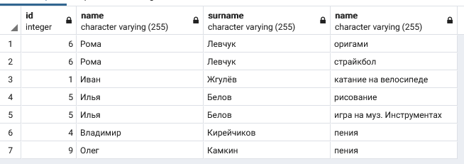

<br></br>

### <a name="3_2"></a> Вывести информацию о студенте, занимающимся хобби самое продолжительное время.

#### `Запрос`

```SQL
SELECT 	st.id, st.name, st.surname, hb.name,
		st_hb.date_finish - st_hb.date_start days
FROM students st,
     hobby hb, 
	 students_hobbies st_hb
where   hb.id= st_hb.hobby_id and 
        st.id= st_hb.student_id and 
        st_hb.date_finish - st_hb.date_start is not null
order by days DESC
limit 1
```

#### `Вывод`

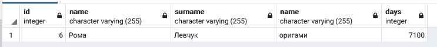

<br></br>

### <a name="3_3"></a> Вывести имя, фамилию, номер зачетки и дату рождения для студентов, средний балл которых выше среднего, а сумма риска всех хобби, которыми он занимается в данный момент, больше 9.

#### `Запрос`

```SQL
SELECT 	st.name, st.surname, 
        st.n_group,st.date_birth, 
        hb.name

FROM 	students st,
     	hobby hb, 
	 	students_hobbies st_hb
where hb.id= st_hb.hobby_id and 
      st.id= st_hb.student_id and 
      st_hb.date_finish is null and
	  st.score > (SELECT AVG(st.score) FROM students st) and
	  hb.risk > 0.9

```

#### `Вывод`

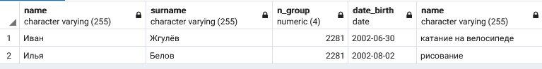

<br></br>

### <a name="3_4"></a> Вывести фамилию, имя, зачетку, дату рождения, название хобби и длительность в месяцах, для всех завершенных хобби Диапазон дат.

#### `Запрос`

```SQL
SELECT 	st.name, st.surname, st.n_group,st.date_birth, hb.name, (st_hb.date_finish - st_hb.date_start)/30 as month
FROM 	students st,
     	hobby hb, 
	 	students_hobbies st_hb
where 	hb.id= st_hb.hobby_id and 
      	st.id= st_hb.student_id and 
		st_hb.date_finish is not null
```

#### `Вывод`

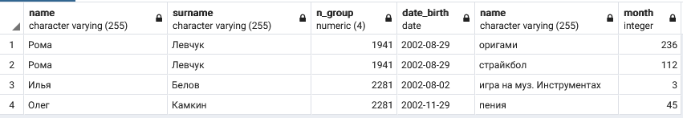

<br></br>

### <a name="3_5"></a> Вывести фамилию, имя, зачетку, дату рождения студентов, которым исполнилось N полных лет на текущую дату, и которые имеют более 1 действующего хобби.

#### `Запрос`

```SQL
SELECT 	st.id, st.name, st.surname, st.n_group, 
        st.date_birth, COUNT(st_hb.hobby_id) count
FROM 	students st,
     	hobby hb, 
	 	students_hobbies st_hb
where 	hb.id= st_hb.hobby_id and 
      	st.id= st_hb.student_id and 
		date_part('year', now()) - date_part('year', st.date_birth) > 19
		GROUP BY st.id,  st.name, st.surname, st.n_group, st.date_birth
		HAVING COUNT(st_hb.hobby_id) > 1
```

#### `Вывод`

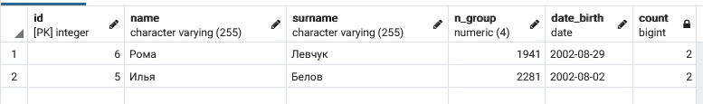

<br></br>

### <a name="3_6"></a> Найти средний балл в каждой группе, учитывая только баллы студентов, которые имеют хотя бы одно действующее хобби.

#### `Запрос`

```SQL
SELECT 	st.n_group, avg(st.score) sr
FROM 	students st,
     	hobby hb, 
	 	students_hobbies st_hb
where 	hb.id= st_hb.hobby_id and 
      	st.id= st_hb.student_id
GROUP BY st.n_group
```

#### `Вывод`

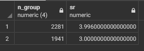

<br></br>

### <a name="3_7"></a> Найти название, риск, длительность в месяцах самого продолжительного хобби из действующих, указав номер зачетки студента.

#### `Запрос`

```SQL
SELECT 	hb.name, hb.risk, max(st_hb.date_finish - st_hb.date_start)/30 max_time, st.name, st.surname
FROM 	students st,
     	hobby hb, 
	 	students_hobbies st_hb
where 	hb.id= st_hb.hobby_id and 
      	st.id= st_hb.student_id
GROUP BY hb.name, hb.risk, st.name, st.surname
HAVING max(st_hb.date_finish - st_hb.date_start)/30 is not null
order by max_time DESC
limit 1
```

#### `Вывод`

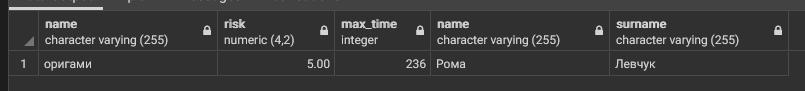

<br></br>

### <a name="3_8"></a>  Найти все хобби, которыми увлекаются студенты, имеющие максимальный балл.

#### `Запрос`

```SQL
SELECT 	hb.name, max(st.score) max_score
FROM 	students st,
     	hobby hb, 
	 	students_hobbies st_hb
where 	hb.id= st_hb.hobby_id and 
      	st.id= st_hb.student_id
GROUP BY hb.name
```

#### `Вывод`

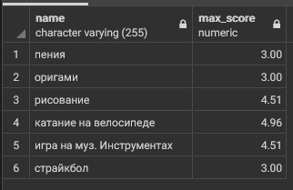

<br></br>

### <a name="3_9"></a>  Найти все действующие хобби, которыми увлекаются троечники 2-го курса.

#### `Запрос`

```SQL
SELECT 	hb.name, st.name, st.surname, st.score
FROM 	students st,
     	hobby hb, 
	 	students_hobbies st_hb
where 	hb.id= st_hb.hobby_id and 
      	st.id= st_hb.student_id and
		st_hb.date_finish is null and
		st.n_group >1999 and
		st.n_group < 3000 and
		st.score <= 4.51
```

#### `Вывод`

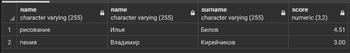

<br></br>

### <a name="3_10"></a> Найти номера курсов, на которых более 50% студентов имеют более одного действующего хобби.

#### `Запрос`

```SQL
SELECT *
FROM
  (SELECT LEFT(st.n_group::VARCHAR,1), COUNT(st.id) 
    FROM students st
    GROUP BY
      LEFT(st.n_group::VARCHAR,1)) total
INNER JOIN
  (SELECT LEFT(st.n_group::VARCHAR,1), COUNT(st.id)
    FROM
      students st,
      (SELECT st.id, COUNT(st.id) FROM students st
        INNER JOIN students_hobbies sth
        ON sth.id = st.id
        INNER JOIN hobby h
        ON sth.hobby_id = h.id
        WHERE sth.date_finish IS NULL
        GROUP BY st.id
        HAVING COUNT(st.id) > 1) morethanone
    WHERE
      st.id = morethanone.id
    GROUP BY
      LEFT(st.n_group::VARCHAR,1)) morethanone
ON total.left = morethanone.left
WHERE
  total.count / 2 < morethanone.count
```

`взял у Кости, слишком уж геморное задание`

#### `Вывод`

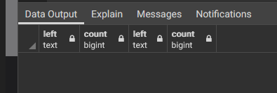

<br></br>

### <a name="3_11"></a>   Вывести номера групп, в которых не менее 60% студентов имеют балл не ниже 4.

#### `Запрос`

```SQL
SELECT sub.n_group
FROM
  (SELECT 
    st.n_group, 
    COUNT(st.id) total_count, 
    COUNT(st.score) FILTER (WHERE st.score > 4) above_score_count
  FROM students st
  GROUP BY st.n_group) sub
WHERE sub.total_count*0.6 < above_score_count
```

#### `Вывод`

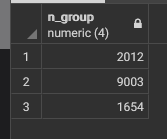

<br></br>

### <a name="3_12"></a>  Для каждого курса подсчитать количество различных действующих хобби на курсе.

#### `Запрос`

```SQL
select left(st.n_group::varchar, 1) cours, count(hb.name) col_vo_hobby
from students st, students_hobbies st_hb, hobby hb
where st.id = st_hb.student_id and
		hb.id = st_hb.hobby_id
group by cours
```

#### `Вывод`


<br></br>

### <a name="3_13"></a>  Вывести номер зачётки, фамилию и имя, дату рождения и номер курса для всех отличников, не имеющих хобби. Отсортировать данные по возрастанию в пределах курса по убыванию даты рождения.

#### `Запрос`

```SQL
select st.id, st.name, st.surname, st.date_birth, left(n_group::varchar, 1) n_cours
from hobby hb, students st, students_hobbies st_hb
where (st.id not in -- кто никогда не имел хобби
			(select st_hb.student_id
			from students_hobbies st_hb
			group by st_hb.student_id) or
	   (st.id in    -- кто имел но все закончил
			(SELECT sth.id
    		FROM students_hobbies sth
    		GROUP BY sth.id
    		HAVING COUNT(sth.date_finish) = COUNT(sth.date_start)))) and
	   st.score >= 4.5
group by st.id, n_cours,  st.name, st.surname, st.date_birth
```

#### `Вывод`

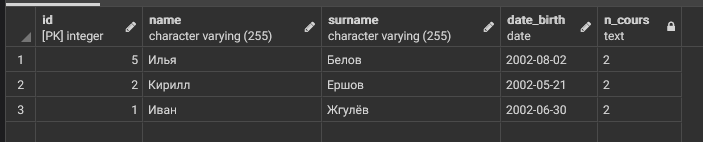

<br></br>

### <a name="3_14"></a> Создать представление, в котором отображается вся информация о студентах, которые продолжают заниматься хобби в данный момент и занимаются им как минимум 5 лет.

#### `Запрос`

```SQL
select st.id, st.name, st.surname, (now()::date - st_hb.date_start)/365 years
from hobby hb, students st, students_hobbies st_hb
where 	st_hb.student_id = st.id and
		st_hb.hobby_id = hb.id and
		st_hb.date_finish is null and
		(now()::date - st_hb.date_start)/365 > 5
		
group by st.id,  st.name, st.surname, st_hb.date_start
```

#### `Вывод`

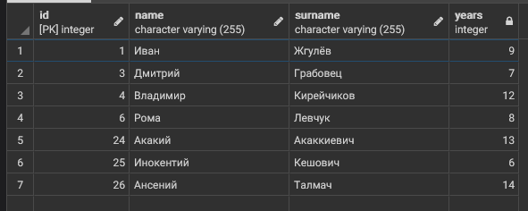

<br></br>

### <a name="3_15"></a> Для каждого хобби вывести количество людей, которые им занимаются.

#### `Запрос`

```SQL
SELECT h.name, COUNT(DISTINCT sth.id)
FROM hobby h
INNER JOIN students_hobbies sth
ON h.id = sth.hobby_id
GROUP BY h.name
```

#### `Вывод`

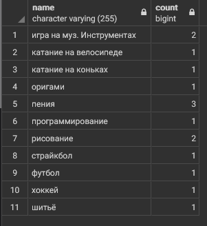

<br></br>

### <a name="3_16"></a> Вывести ИД самого популярного хобби.

#### `Запрос`

```SQL
SELECT h.name, COUNT(DISTINCT sth.id)
FROM hobby h
INNER JOIN students_hobbies sth
ON h.id = sth.hobby_id
GROUP BY h.name
```

#### `Вывод`


<br></br>

### <a name="3_16"></a> Вывести ИД самого популярного хобби.

#### `Запрос`

```SQL
SELECT h.name, COUNT(DISTINCT sth.id) counte
FROM hobby h
INNER JOIN students_hobbies sth
ON h.id = sth.hobby_id
GROUP BY h.name
order by counte desc
limit 1
```

#### `Вывод`

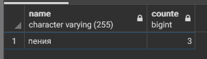

<br></br>

### <a name="3_17"></a> Вывести всю информацию о студентах, занимающихся самым популярным хобби.

#### `Запрос`

```SQL
select st.id, st.name, st.surname, st.n_group
from students st
INNER JOIN students_hobbies st_hb
on st.id = st_hb.student_id
where 
	st_hb.hobby_id = (SELECT st_hb.hobby_id
    	FROM students_hobbies st_hb
    	GROUP BY st_hb.hobby_id
    	ORDER BY COUNT(st_hb.id) DESC
    	LIMIT 1) and
	st_hb.date_finish is null

```

#### `Вывод`

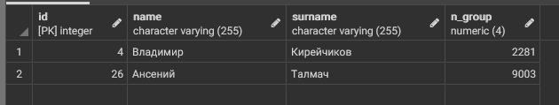

<br></br>

### <a name="3_18"></a> Вывести ИД 3х хобби с максимальным риском.

#### `Запрос`

```SQL
select hb.id, hb.name, hb.risk
from hobby hb
order by hb.risk desc
limit 3
```

#### `Вывод`

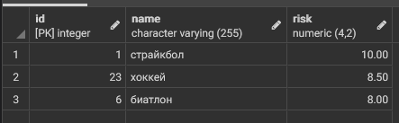

<br></br>

### <a name="3_19"></a> Вывести 10 студентов, которые занимаются одним (или несколькими) хобби самое продолжительно время.

#### `Запрос`

```SQL
select st.id, st.name, st.surname, hb.name, now()::date - st_hb.date_start days
from hobby hb, students st, students_hobbies st_hb
where 	st.id = st_hb.student_id and
		hb.id = st_hb.hobby_id and
		st_hb.date_finish is null
order by days desc
limit 10
```

#### `Вывод`

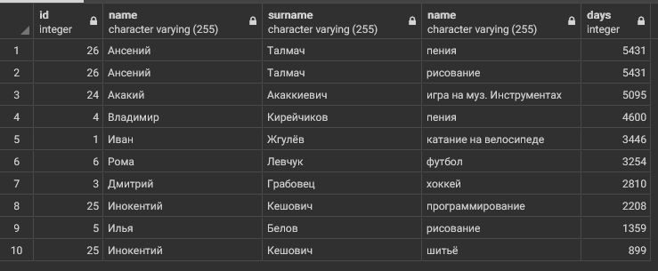

<br></br>

### <a name="3_20"></a> Вывести номера групп (без повторений), в которых учатся студенты из предыдущего запроса.

#### `Запрос`

```SQL
select tb.n_group
from (
	select st.id, st.n_group, st.name, st.surname, hb.name, now()::date - st_hb.date_start days
	from hobby hb, students st, students_hobbies st_hb
	where 	st.id = st_hb.student_id and
			hb.id = st_hb.hobby_id and
			st_hb.date_finish is null
	order by days desc
	limit 10) tb
group by tb.n_group
```

#### `Вывод`

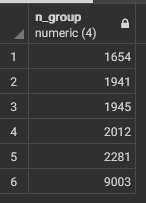

<br></br>

### <a name="3_21"></a> Создать представление, которое выводит номер зачетки, имя и фамилию студентов, отсортированных по убыванию среднего балла.

#### `Запрос`

```SQL
select st.id, st.n_group, st.name, st.surname, st.score
from students st
order by st.score desc
```

#### `Вывод`

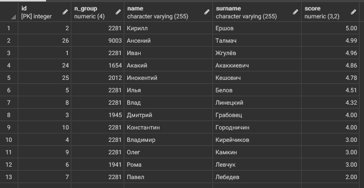

<br></br>

### <a name="3_22"></a> Представление: найти каждое популярное хобби на каждом курсе.

#### `Запрос`

```SQL

```

#### `Вывод`


<br></br>